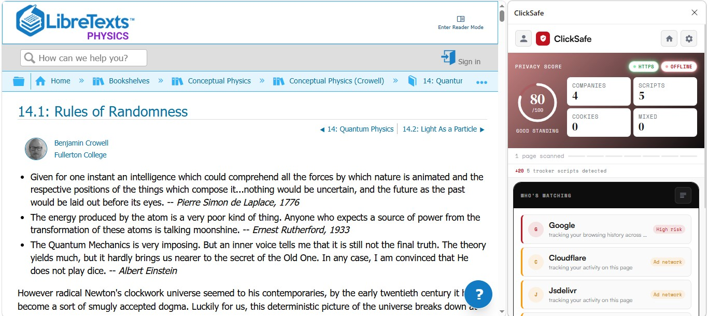
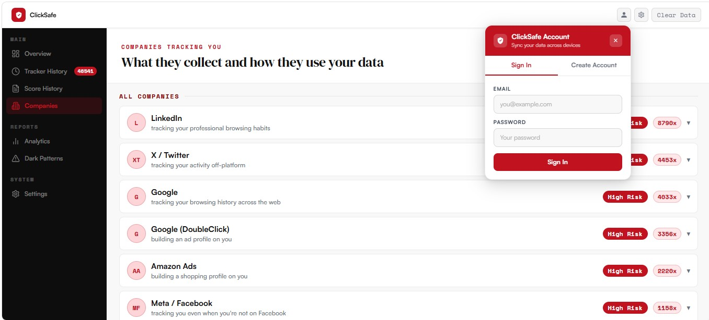
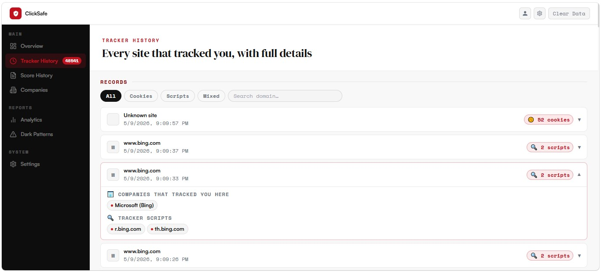
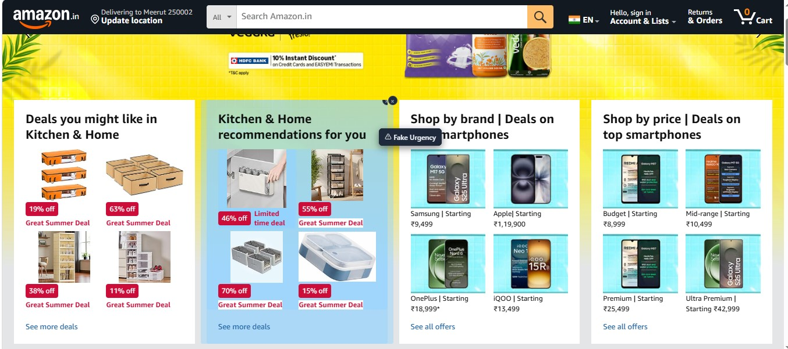
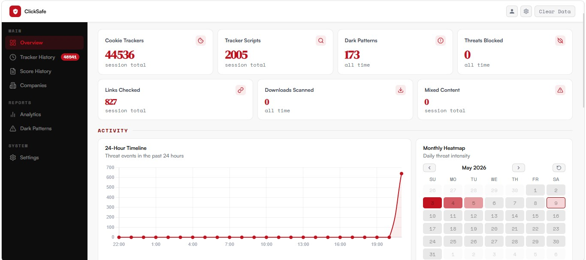
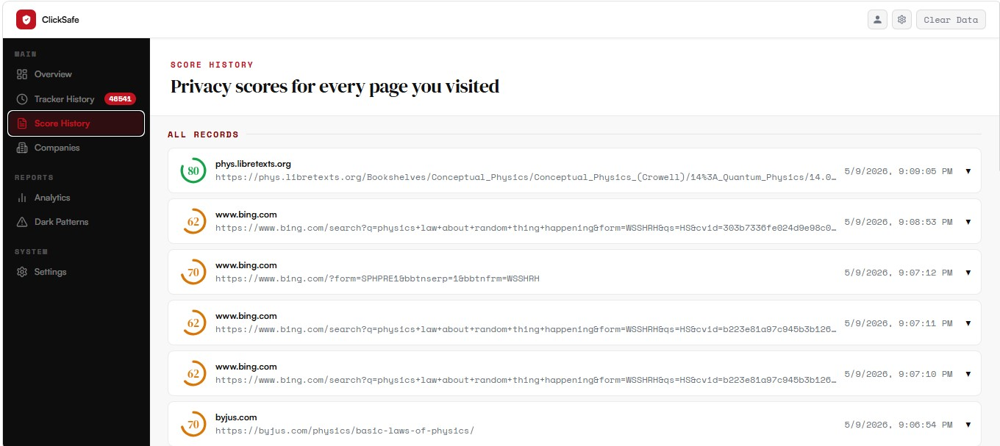

# ClickSafe

> **The privacy co-pilot your browser is missing — real-time tracker blocking, Google Safe Browsing link checks, HTTPS enforcement, download scanning, and dark pattern detection, all in a single Chrome extension.**

[](https://developer.chrome.com/docs/extensions/mv3/)
[](https://nodejs.org)
[](https://mysql.com)
[](https://safebrowsing.google.com)
[](https://expressjs.com)
[](LICENSE)

---

## Preview



---

## What It Does

ClickSafe is a full-stack Chrome extension (Manifest V3) that runs a live privacy and security analysis on every page you visit. It checks links before you click them, blocks tracker scripts from 70,000+ known domains, enforces HTTPS, scans downloads, and highlights manipulative UI patterns — all in real time, from a persistent side panel.

URLs are hashed and checked **locally first** using Google Safe Browsing prefixes stored in your browser. A full network request only happens if a local prefix match is found, so the sites you visit stay private unless they're actually suspicious.

---

## Features

### Privacy Score

A live 0–100 score for the current page, calculated from HTTPS status, tracker scripts, tracking cookies, and mixed content. Updates every time you navigate. The score ring, verdict label, and per-signal breakdown are always visible in the side panel.


### Tracker Blocking

Checks every request against a local 70,000-entry blocklist. The **Who's Watching** panel shows exactly which companies are tracking you on the current page — by name, script count, and cookie count.



Flip to the **Tracker History** view to see a full record of every site that tracked you, with individual tracker scripts and cookies per visit.



### Link Safety

On every hover, the extension hashes the URL and checks it against locally-stored Google Safe Browsing prefixes. If a prefix matches, the backend confirms the full hash against the Safe Browsing API. A blocking modal warns you before you land on a malware or phishing page.


### Download Scanner

Intercepts every browser download and checks the source URL against Safe Browsing before the file saves. Dangerous downloads are blocked and flagged with the threat type.

### HTTPS Enforcement

Detects unencrypted HTTP connections, mixed content (HTTPS pages loading HTTP resources), and missing security headers. Each signal feeds directly into the privacy score with a clear explanation of what went wrong.

### Dark Pattern Detection

The content script scans every page for five manipulative UX patterns and highlights them with a dismissible overlay:

| Pattern | What it catches |
|---|---|
| **Fake Urgency** | "Only 2 left!", "Offer ends in 10 minutes" keyword scoring |
| **Confirm Shaming** | Decline buttons phrased to make users feel bad |
| **Fake Countdown** | Timer elements with countdown-style selectors |
| **Pre-ticked Checkboxes** | Marketing opt-ins checked by default |
| **Cookie Manipulation** | Cookie banners where the reject button is hidden or de-emphasised |



### Dashboard

Full-page analytics with session stats, a 24-hour activity timeline, and a monthly heatmap of threat intensity.



Drill into **Score History** to see per-site privacy scores for every page you've visited.



---

## Quick Start

**Prerequisites:** Node.js 18+ · MySQL 8.0+ · Chrome (or any Chromium browser)

### 1. Clone

```bash
git clone https://github.com/<your-username>/clicksafe.git
cd clicksafe
```

### 2. Backend

```bash
cd backend
cp .env.example .env      # fill in your API key and DB credentials
npm install
node server.js
# → http://localhost:3000
```

Your `.env` should look like this:

```env
GOOGLE_SAFE_BROWSING_API_KEY=AIza...your_key_here

DB_HOST=localhost
DB_PORT=3306
DB_USER=root
DB_PASSWORD=your_mysql_password
DB_NAME=clicksafe_db

PORT=3000
NODE_ENV=development
JWT_SECRET=a_long_random_secret
ALLOWED_ORIGINS=chrome-extension://*
```

A free Google Safe Browsing API key allows 10,000 lookups/day — more than enough for personal use. Get one at [Google Cloud Console](https://console.cloud.google.com/) → APIs & Services → Safe Browsing API.

### 3. Database

```bash
mysql -u root -p -e "CREATE DATABASE IF NOT EXISTS clicksafe_db;"
mysql -u root -p clicksafe_db < database/schema.sql
mysql -u root -p clicksafe_db < database/seed.sql   # optional test data
```

Enable the 24-hour cache cleanup event (run once in MySQL):

```sql
SET GLOBAL event_scheduler = ON;
```

### 4. Load the Extension

1. Open Chrome → `chrome://extensions`
2. Enable **Developer Mode** (top-right toggle)
3. Click **Load unpacked** → select the `frontend/` folder
4. The ClickSafe shield icon appears in your toolbar — click it and open the side panel

---

## Privacy Score Formula

Scores run from 0 to 100. The extension starts at 100 and subtracts penalties:

| Signal | Deduction | Cap | Rationale |
|---|---|---|---|
| No HTTPS | −30 flat | — | Binary: all traffic is exposed. A clean HTTP site should never score above 70. |
| Tracking cookies | −5 each | −30 | Persistent and identity-linked. Even one is meaningful; beyond 6 the harm plateaus. |
| Tracker scripts | −4 each | −20 | Session-scoped and easier to block. Less severe per unit than cookies. Cap at 5. |
| Mixed content | −5 each | −20 | Each leaks your HTTPS session to an HTTP endpoint. Cap at 4 resources. |

```
score = 100
      − 30                              (if not HTTPS)
      − min(trackingCookies × 5, 30)
      − min(trackerScripts × 4, 20)
      − min(mixedContent × 5, 20)

score = clamp(score, 0, 100)
```

The formula lives in `frontend/background/privacyScore.js` and is mirrored in `frontend/pages/dashboard/dashboard.js`. If you change the weights, update both.

---

## How Safe Browsing Works (Privacy-First)

```
1. On startup, the extension fetches hash prefixes from Google Safe Browsing
   via your backend and stores them locally in chrome.storage.local.

2. On every hover / navigation, the extension:
   a. SHA-256 hashes the URL
   b. Checks the local prefix list — URL never leaves the browser here

3. Only if a local prefix match is found:
   a. Extension sends the full hash to your backend
   b. Backend confirms against Safe Browsing API v4
   c. Result cached in MySQL for 24 hours

4. If confirmed dangerous → blocking modal is shown.
```

This means Google never sees the URLs of clean sites you visit — only the ones that match a known-bad prefix.

---

## API Reference

All endpoints accept and return JSON. Default base URL: `http://localhost:3000`.

| Method | Endpoint | Description |
|---|---|---|
| GET | `/api/health` | Health check + DB connection status |
| POST | `/api/check-link` | Check a URL against Safe Browsing |
| POST | `/api/check-download` | Check a download URL |
| POST | `/api/sb-prefixes` | Fetch / update local Safe Browsing prefix list |
| GET | `/api/blocklist` | Serve tracker domain blocklist to extension |
| GET/POST/DELETE | `/api/whitelist` | User's trusted domain list |
| GET/POST | `/api/score-history` | Privacy score history per user |
| POST | `/api/dark-patterns` | Log detected dark patterns |
| POST | `/api/contact` | Contact form submission |
| POST | `/api/auth/register` | Create account |
| POST | `/api/auth/login` | Login + receive JWT |

**Check a link:**

```bash
curl -X POST http://localhost:3000/api/check-link \
  -H "Content-Type: application/json" \
  -d '{"url": "https://example.com/page"}'
```

```json
{
  "safe": true,
  "url": "https://example.com/page",
  "threat": null,
  "checked_at": "2025-05-01T12:00:00.000Z",
  "cached": false
}
```

**Confirm a full hash match** (called internally by the extension when a prefix hits):

```bash
curl -X POST http://localhost:3000/api/check-link \
  -H "Content-Type: application/json" \
  -d '{"url": "https://suspicious.com", "hash": "<sha256hex>", "threatType": "MALWARE"}'
```

**Check a download:**

```bash
curl -X POST http://localhost:3000/api/check-download \
  -H "Content-Type: application/json" \
  -d '{"url": "https://example.com/file.exe", "filename": "file.exe"}'
```

---

## Project Structure

```
clicksafe/
├── README.md
│
├── backend/                          ← Node.js / Express API
│   ├── server.js                     # Entry point
│   ├── .env.example                  # Copy to .env and fill in
│   ├── config/
│   │   └── database.js               # MySQL connection pool
│   ├── controllers/
│   │   ├── linkController.js         # /api/check-link + DB cache
│   │   ├── downloadController.js     # /api/check-download + DB cache
│   │   ├── sbUpdateController.js     # /api/sb-prefixes
│   │   ├── authController.js         # Register / login / JWT
│   │   ├── blocklistController.js    # Tracker blocklist serving
│   │   ├── whitelistController.js    # Per-user trusted domains
│   │   ├── scoreHistoryController.js # Privacy score history
│   │   ├── darkPatternController.js  # Dark pattern event log
│   │   └── trackerEncounterController.js
│   ├── middleware/
│   │   ├── auth.js                   # JWT verification
│   │   ├── cors.js
│   │   ├── rateLimiter.js
│   │   ├── errorHandler.js
│   │   └── inputValidation.js        # URL + filename validators
│   ├── routes/                       # One file per endpoint group
│   ├── services/
│   │   └── safeBrowsingService.js    # Google Safe Browsing API calls
│   └── tests/
│       └── api.test.js
│
├── database/
│   ├── schema.sql                    # Tables + 24hr cache-cleanup event
│   └── seed.sql                      # Optional test rows
│
├── frontend/                         ← Chrome Extension (Manifest V3)
│   ├── manifest.json
│   ├── background.js                 # Service worker entry point
│   ├── background/
│   │   ├── privacyScore.js           # Score formula + badge updater
│   │   ├── safeBrowsing.js           # Local prefix lookup + hash confirmation
│   │   ├── cookieScanner.js          # Tracking cookie detection per tab
│   │   ├── trackerBlocklist.js       # 70k-entry blocklist loader
│   │   └── settings.js               # Extension settings R/W
│   ├── content/
│   │   ├── content.js                # Injected into every page
│   │   └── modal/                    # Threat warning overlay
│   ├── data/
│   │   └── trackers.json             # Local tracker blocklist
│   ├── pages/
│   │   ├── dashboard/                # Full dashboard + score history charts
│   │   ├── settings/                 # Settings page
│   │   └── onboarding/               # First-run onboarding
│   ├── sidepanel/                    # Main side panel UI
│   └── utils/
│       ├── auth.js                   # Auth flow helpers
│       ├── auth-modal.js             # Login / register modal
│       ├── account-panel.js          # Account panel UI
│       ├── cookieTracker.js          # Cookie classification
│       ├── helpers.js                # Shared utilities
│       ├── httpsMonitor.js           # HTTPS upgrade detection
│       ├── settingsPorter.js         # Import / export settings
│       └── storage.js                # chrome.storage helpers
│
├── landing-page/                     ← Static marketing site
│   ├── index.html
│   ├── features.html
│   ├── how-it-works.html
│   ├── installation.html
│   ├── about.html
│   └── privacy.html
│
└── render.yaml                       ← Render.com deploy config
```

---

## Tech Stack

| | Purpose |
|---|---|
| [](https://developer.chrome.com/docs/extensions/mv3/) | Extension runtime |
| [](https://nodejs.org) | Backend runtime |
| [](https://expressjs.com) | REST API framework |
| [](https://mysql.com) | Result cache + user data |
| [](https://safebrowsing.google.com) | Threat intelligence |
| [](https://jwt.io) | Auth tokens |
| [](https://chartjs.org) | Dashboard charts |
| [](https://lucide.dev) | UI icons |

---

## Deploy to Render

The repo includes `render.yaml` — Render reads it automatically when you connect the repo.

### Backend → Render

1. Push to a public GitHub repository
2. Go to [render.com](https://render.com) → **New** → **Blueprint** → connect your repo
3. Render detects `render.yaml` and creates the `clicksafe-backend` web service
4. Set the following in the Render dashboard (never commit these):

| Variable | Value |
|---|---|
| `GOOGLE_SAFE_BROWSING_API_KEY` | Your Google Cloud API key |
| `JWT_SECRET` | A long random string |
| `DB_HOST` | Your MySQL host (e.g. PlanetScale or Railway) |
| `DB_USER` | DB username |
| `DB_PASSWORD` | DB password |
| `DB_NAME` | `clicksafe_db` |

5. Deploy — copy the generated `https://clicksafe-backend.onrender.com` URL

### Extension → point at your backend

Update the fetch calls in `frontend/background/safeBrowsing.js` that reference `localhost:3000` to use your Render URL. The `host_permissions` in `manifest.json` already includes `https://*.onrender.com/`.

> **Note:** The free Render tier spins down after inactivity (~30s cold start on first request). Upgrade to Starter for always-on.

---

## Roadmap

- [ ] Firefox / Edge support (WebExtensions API parity)
- [ ] Per-domain tracker history graph in dashboard
- [ ] Export privacy report as shareable PNG card
- [ ] Phishing visual fingerprint similarity detection
- [ ] VPN / DNS leak detection
- [ ] Team / family account with shared whitelist
- [ ] CLI tool for batch URL safety checks via the backend

---

## License

MIT License — see [LICENSE](LICENSE) for details.

---

## Acknowledgements

- Threat intelligence from [Google Safe Browsing API v4](https://safebrowsing.google.com)
- Tracker blocklist sourced from community-maintained domain lists (70,000+ entries)
- Icons by [Lucide](https://lucide.dev)
- Charts by [Chart.js](https://chartjs.org)
- Fonts: [DM Serif Display](https://fonts.google.com/specimen/DM+Serif+Display), [Space Mono](https://fonts.google.com/specimen/Space+Mono), [Satoshi](https://fontshare.com/fonts/satoshi)